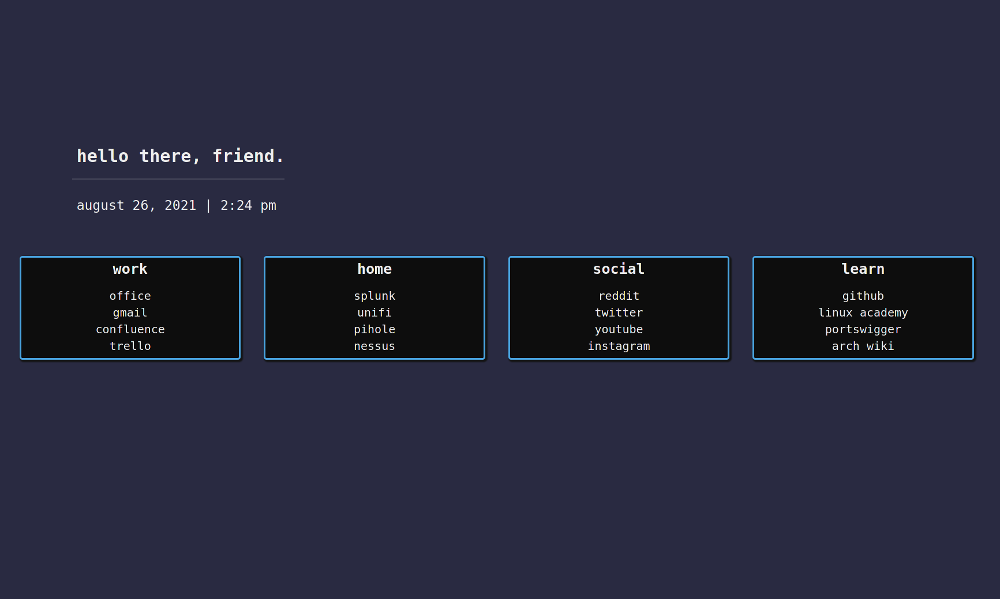

# startpage-sanctuary
Startup Page for browsers. 

### Installation
Clone the repo and set the file path for index.html as the homepage url. Should look similar to the below:

`file:///home/papa/Documents/startpage-sanctuary-main/startup/index.html`
